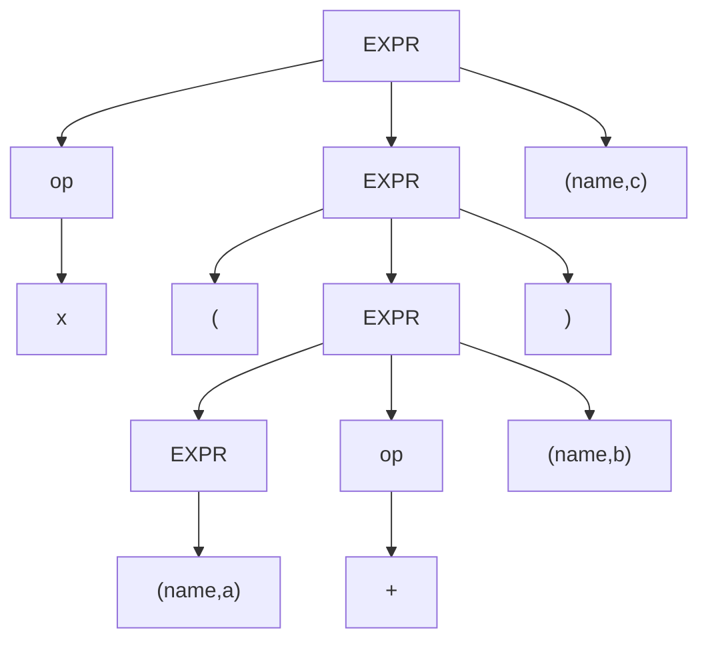

# 记录编译原理的学习过程

## 大致内容

>date:2022-4-15

1. 可能会实现编译器前端的基本构造（词法分析器，语法分析器）
2. 语言可能会使用python 或者 c
3. 估计（1）（2）都不会是吸纳

## 记录

## DAY-1

>date:2022-4-15-9:56
>
>看了《编译器设计》第一章 编译器概述：难度巨大，写了这个README 分配了指定的任务

## day-2

>date:2022-4-16-23:08
>
>词法分析器（第二章开个头吧）！！
>
>syntactic category：语法范畴
>

## Day-3

>接4-17w晚上 第二章 词法分析器的概览
>
>词法分析的数学工具(我们是从伪代码开始 引入伪代码的抽象化表示->状态转移图形 )：我们得到了一种形式化的数学工具：有限自动机 
>
>有限自动机的形式化定义如下：
>
>$(S,\Sigma,\delta,s_0,S_A)$
>
>其中各分量的定义如下：
>
>1. $S$ 是识别器中的有限转态集 ，以及一个错误的状态
>
>2. $\Sigma$ 是识别器中使用的有限字母表 通常啊 $\Sigma$ 是状态转移图的边的标签的集合（可接受的字符）
>3. $\delta(s,c)$是识别器的 转移函数 ，他将每一个状态 $s\in S和每个字符 c \in \Sigma 的组合（s，c）映射到 下一个状态。\\即在状态s_i遇到输入字符c，FA(有限自动机)将采用s_i \stackrel c\rightarrow \delta(s_i,c) $ 
>4. $S_A$是接受状态集合，$S_A \subseteq S \space S_A$中的每个状态 都在 转移图中表示为 双层圆圈

## day-4

>接4-17晚间的词法分析的学习：
>
>了解了什么是FA后 ，我们进行相应的FA的跟随操作:
>
>其中有一种比较特殊的 FA（识别相应的数字字符（numerical））：
>
>1. 其相应的FA中含有无穷多的状态也即是$S$的个数为$\infty$
>2. 且对应某些状态，其转移函数的得接受字符完全一致
>
>我们引出对FA的进一步完善的操作，允许FA（转移图有环）（对应上述（01）（02））
>
>通过允许环的存在，对于该种全域的类型我们有了相应的处理方法，但是这种解决办法并简洁，为简化词法分析器，我们引入正则表达式（Regular Expression RE）的符号表示法来描述其语言 ，通过RE描述的语言我们称为正则语言（正则表达式等效于FA）
>
>我们来详细的探讨一下正则表达式：
>
>我们先沿用FA的概念：FA$-f$所接受单词的集合，我们可以把其称作为语言$l(f)$ ,我们使用RE来描述语言，用一种更加形式化的操作来实现（非转态转移图的）但是
>
>1. 仍然是采取和自动机一样的字符流（逐个字符匹配的原则） 其中(分叉) or 用| 表示 （）内部表示一个整体，以及满足交对或的分配率 ，用正则表达式来表示 人类语言对指定语言的描述.
>2. 对于复杂的 无穷集语言 （FA存在环）我们用$*$表示 ‘零次或多次出现’的概念,我们把$*$运算符号，称为柯林闭包（Kleene closure）简称闭包（注意这里闭包的结果不是最后形成的那个字符串而是整个过程中的所有字符集合取并集）
>
>这一切的目的都是为了更加的形式化！！
>

## day-5

>接4-18日的学习
>
>我们来详细的说明相应的符号表示法的形式化操作：
>
>正则表达式是我们所选择的形式化表达语言的工具，我们来严格的定义一下相应正则表达式：（对于给定的RE r 来说，我们将它规定的语言记住L(r)）
>
>一个RE有三个基本操作构成：
>
>1. 选择 ：即是昨天所说的 | 记为两个字符串的交替或者并集 ,所形成的所有字符串
>2. 连接： 形如$RS$ 表示R中任意一个元素后接S中任意一个元素所形成的的所有字符串 
>3. 闭包： 形如$R^{*}$ 表示 R与自身连接零次或者多次所形成的所有字符串
> 1. 有限闭包即是 $R^{N}$ (N为整数) 表示自身连接1~N次的
> 2. 正闭包：即是$R^{+}$表示连接1到任意次数
>4. 求补运算符：^c表示集合{$\Sigma -c$} 即是相应的字符表中去除字符c
>5. 括号的优先级最高，依次是求补、闭包、连接、选择
>
>我们来看一些例子：
>
>由于我们规定了RE的三个操作，那么我们可以用RE来描述我们所想表达的字符集合了
>
>1. 无符号实数$(0|([1…9][0…9]^{*})(.[0…9]^{*}|\xi)$ 
>
>我们发现对应复杂的字符集合我们的RE也越来越复杂，我们先期使用正则替代相应的FA(即是状态转移图)的目的就是为了形式化， 但是最终仍是要转移到相应的FA的，那么复杂的RE:
>
>1. 所得到的FA的运行效率与输入长度成正比，与RE无关
>2. RE的复杂性导致了FA生成的代价上升
>
>续接上午所述：
>
>在解决相应的无穷序列的语言时，FA的解决是存在环，正则的解决是闭包运算：
>
>接下了我们来研究下相应的正则的闭包性质（正则语言就是 可以用正则表达式定义的语言都是正则语言）
>
>RE的闭包性质：
>
>1. 在并集操作(选择操作)下的闭包性质：即是RE的并集仍是RE：我们可以利用这一性质对有限的单词集合构造RE,通过一个‘大的’的选择操作将所有的单词列出
>2. 连接操作下的闭包性质：通过连接比较简单的RE来构建复杂的RE:它使得我们可以系统化的拼凑，分析RE。
>3. 柯林闭包，有限闭包操作下，正则表达式也是封闭的 ，我们可以用有限的模式，来定义种类的庞大 甚至无穷的集合
>
>(ps:RE与FA之间的等价性我们还会在下面进行叙述：这里提纲要领的说一下：给出一个完成的FA,我们可以构造出一个用于识别不在L(FA)中的所有单词，只需要把原FA的接受与非接受状态交换即可，====>即是：RE在补集操作下是封闭的)
>
>我们继续探讨FA与RE之间的关系：
>
>我还是要阐述一下我们的目的是什么：我们的目的是更好的实现相应的FA，也就是自动化生成词法分析器：为了达到这一目的，我们需要学习相应的RE到FA的算法：
>
>1. 为此我们需要先学习一下：DFA NFA的区别，以及了解一下何为NFA，是怎么产生的：
>   1. NFA:即是：非确定性有穷自动机，也就是存在条件字符的输入，无法确定该FA是怎么进行转态转移的（更加专业的说：其转移函数不是单射的，而是多射的）
>   2. 为什么会出现NFA呢？正如上文所说的正则表达式具有连接的闭包性质，易得FA也应该具有相同的性质，如果我们需要组合FA识别相应L(FA)的连接字符集合，我们就可以通过从一个FA的接受状态进行$\xi$ 转移来实现FA的连接操作，但是$\xi$的引入也导致了转移函数的多射性质（换言之NFA与DFA具有相互转换的性质）
>   3. 关于DFA，有两种模型：
>      1. 全知NFA:非确定条件转移时，采取使得输入字符串向可接受状态的状态转移
>      2. 多重世界NFA:进行非确定性转移时，NFA克隆自身，NFA并发的追踪所有的转移路径，当NFA到达某一配置（NFA上的并发活动状态集合），此时NFA已经耗尽字符串，且某一配置状态处于可接受状态，则说明NFA接受该字符串
>   4. 无论是iii中的那种模型，对于字符的可接受（识别）都是存在路径起始于$S_0$终结与$S_A$ 消耗所有条件字符。
>   5. NFA与DFA是等价的，任何一个NFA都可以通过DFA来模拟（子集构造法）DFA模拟NFA没有时间问题，存在空间问题（状态空间指数倍增）
>

## day-6

>昨天我们从正则表达式的运算性质到如何从正则表达式生成指定的FA，介绍了NFA DFA 的概念，今天我们来详细的阐述一下如何从正则表达式到NFA(Thompson构造法):
>
>Thompson构造法的原理，构造一些接受的RE(RE的基本操作具有闭包的性质，运算后也仍是RE):
>
>1. 观察RE表达式，得到基元状态（单个字符的接受）的FA
>2. 根据RE表达式的运算法则，利用Thompson的的基本构造法来实现
>   1. 选择：添加一个初始状态，一个接受状态，初始状态具有两条$\xi$ 转移，代表相应的可选项操作，最后统一进行一次$\xi$转移，统统接受到接受状态去
>   2. 闭包：通过取消掉原有的接受状态，添加一个新的接受状态，增加一$\xi$转移条从原有的接受状态到开始状态，增加一条$\xi$转移到新的接受状态
>   3. 连接：消解左式中的接受状态，添加一个新的状态作为过渡，分别从左式中的接受状态，与右式中的初始状态各自添加$\xi$转移到新的转态，保持右式中的接受状态不变，作为整个式子的结束。
>
>我们现在可以用Thompson构造法来实现RE所对应的FA但是有一个问题，我们所得到FA是NFA,而不是DFA,NFA使用程序模拟可就困难多了，接下来我们需要学习一下如何从NFA到DFA,此方法我们也称子集构造法
>
>（注意语法次序树是什么东西，后缀遍历得到？？？？）
>

## day-7

>上接昨天所说的子集构造法：我们要做的是从NFA($N,\Sigma,\delta_n,n_0,N_A$) 为输入，生成一个DFA($D,\Sigma,\delta_d,d_0,D_A$),其中我们需要确定的有：
>
>1. D：该确定化的自动机的所有状态
>2. $\delta_d$ :相应的转移函数
>3. $d_0$：DFA的起始状态
>4. $D_A$：确定的DFA所接受的状态集合
>
>（ps:这里面的$\Sigma$是不需要被确定的，和以前一样）
>
>具体的算法：
>
>介绍一下需要用到的概念：
>
>1. 算法的思路到底是什么？？？
>
>   思路就是消除NFA的不确定性，但是如何消除多射所带来的的对于状态转移的选择呢？子集构造法的思路，是把NFA的有效配置作为状态来保存，因为单步状态的转移应（单步所导致的NFA的配置）是确定唯一的，我们的目的就是探索配置，记录配置的转移函数。
>
>2. $\xi-closure(S)$ ，S为相应的NFA状态构成的集合，经过$ \xi-closure$ 操作后返回一组根据S构造的NFA状态：
>
>具体的方法如下：$\xi-closure$ 检查每一个$s_i \in S$ 并将从$s_i$ 出发通过一个或者多个$\xi$ 转移所能到达的任何状态都添加到S中
>
>对于$\xi-closure(\delta_n(Q_0,\Sigma_i))$ 对于所有$Q_0$集合中的元素调用对应的NFA的$\sigma$以$\Sigma_i$ 为参数得到相应的新状态，且并上$Q_0$中的所有的元素所调用该方法所得到新状态，之后再整体的并集合，进行$\xi-closure(temp)$的求解
>
>介绍一下算法的过程：
>
>大致阐述一下：
>
>1. 首先根据已知NFA的$n_0$ 计算$\xi-closure(n_0)$ 得到的结果作为记录Q集合（探索NFA的全路线配置的起始配置）的第零个元素$Q_0$ ，当然了这个东西也是所要得到的DFA的起始状态$d_0$  
>2. 进行跌代探索Q集合（记录转移函数$\delta_d$ 以及相应的$D中的d_i$ ）将$Q_0$加入$worklist$中进行跌代操作，每次依次从$worklist$中pop元素，对于每个pop出的（$d_i$）集合,进行依次的$\xi-closure(\sigma_n(di,\Sigma_i))$其中i是从$0-len(\Sigma)$ 对每一个i的跌代（也就是每一次都对集合中的所有元素做一次$\Sigma$字符集合中的字符，进行尝试转移） 针对每一次下标的跌代后记录一下$\delta_d(dj,\Sigma_i)=\xi-closure(\sigma_n(dj,\Sigma_i))$ 并且如果得到的$\xi-closure(\sigma_n(di,\Sigma_i))$ 不属于$Q$那么就把该结果$\xi-closure(\sigma_n(di,\Sigma_i))$ 加入到$Q与worklist$中进行下一步跌代操作，注意迭代结束条件为worklist为空
>3. 经过以上的步骤我们确定了我们所需要确定的$D、\delta_d,d_0$还有$D_A$没有被确定，其实不难想到$D_A$就是所得到的D集合（Q）中所有含有原先$N_A$状态的所有状态
>4. 到此我们就确定了所有的未知参量，直接可以画出相应给的FA了
>
>（这里面有一个跌代的次数问题，进行探索的NFA的有效配置，与NFA中的不确定选择有关，一般不确定选择越多，相应的D的集合状态就越多，但是最多不会超过$2^{len(N)}$所以无论如何该算法都会被终止的）
>
>​	相应的伪代码：
>
>
>
>​	手算过程中可以列出此表:
>
>
>接下来我们会介绍两种计算方式  不动点计算 以及 离线计算$\xi-closure$  

## day-8

>时间要来不及了：
>
>我需要加快一点速度了：
>
>modify:2022-4-23
>
>1. 不动点计算：这是一种特定风格的计算：主要是指对取自某个结构已知的域中的集族，重复应用一个单调函数（应该是针对循环条件变量而言的），当计算到达某个状态时，如果进一步的迭代只能得出已有的结果，那么计算将终止，这就相当于连续的迭代在空间中遇到了一个不动点。我们将此过程称为不动点计算。
>2. 离线计算的算法具体实现（目前没看懂啊）：？？？现在还没看懂（2022-4-23-9:10）
>
>有点累了，看不下去了(2022-4-22-22:15)

## day-9

>不管了，我们继续下去：前面我们叙述了如何从正则表达式->NFA，接下来我们又介绍了子集构造法，来把我们所生成的NFA确定化为DFA,但是我们得到的DFA的状态$N_D$的装填太多了（最多可以达到$2^{n}$） ，虽然这样并不会影响程序的运行效率，但是对于程序的存储空间也是一种浪费，所以接下来我们介绍一种DFA的最小化算法——Hopcroft算法：
>
>​	这里需要明确一个概念DFA在作用下的等价性：即是二者对于任何输入字符串都产生相同的行为：相应的Hopcroft算法（目的是减少DFA中的状态）描述为下：
>
>1. 给定DFA,将其状态集合划分为 接受状态与 其他状态 包含到对比集合T中（即是：是否遇到不动点的集合），初始化目标集合$P$为空集（注意集合的划分是互相没有交集的）
>2. 开始迭代（迭代条件：目标集合（$P$） 不等于 被迭代集合$T$），过程中目标集合$把T赋值给P$，每次迭代过程中从集合$P$中取元素进行遍历操作（注意不是POP），对所取元素集合中的每个元素，我们做$split$操作，也就是判断对于该元素中的的每一个状态统一做$\sigma(\Sigma_i)$的状态转换，如果产生的转换都处于当前$T$中的同一个划分元素中，那么此取出的元素集合，就不需要被划分。相反如果产生了非统一划分的元素，那么我们就需要对其 进行划分操作（具体的操作是把相同转移到不相同的状态的状态，给统一划分出去，形成一个单独的划分元素加到集合$T$中）
>3. 等待程序结束，不动点计算完成，我们就获得了相应的集合$P$ ，注意此时的集合p就是我们所得到的最小的DFA的 状态集合！！
>
>对于这个不动点的计算没有什么好说的，很简单， 易懂，主要原则就是具有同样状态转移的状态集合应该被划分到同一集合里去。通过这个算法我们容易得出 该算法性能最差的时候就是我们运用此算法的状态机已经是最小化的了！
>
>以上我们说了那么多的理论从 状态转移图 -> 到FA->正则表达式->利用正则表达式形成FA->介绍DFA、NFA->如何自动化的从正则表达式到FA (NFA) ->如何从NFA到DFA(子集构造法)->如何从DFA到最小化的DFA(Hopcroft算法)
>
>我们来到如何使用DFA做识别器 明天再见吧！
>
>​																										-2022-4-23-21:16

## day-10

>使用DFA做词法分析（识别）器：
>
>  首先有个问题就是:相应的我们的输入是字符流：首先如何分割"单词基元"：我们可以在创建DFA时加入相应的制表符，分隔符的RE。通过将指定程序遇到这些RE所转到的状态，进行判断，来实现程序流程的统一！！
>
>这里我们对相应DFA的接受做了新的定义：（注意我们从来都没有说过接受状态不可以继续转移操作），所以说：接受就是在整个DFA状态转移的过程中，存在经过接受状态的字符序列（且整个过程中没有经历过错误转移）：所以说对于接受的字符有以下的两种情况：
>
>1. 所接受的字符整个满足形成DFA的RE
>2. 所接受的字符是形成DFA的RE的前缀
>
>我们正式开始实现词法分析器:(反正就是DFA转换为可执行代码)：我们有三种方式进行DFA方式的模拟：（注意每个程序的扫描成本都是相同的）
>
>1. 表驱动
>2. 直接编码
>3. 手工编码
>
>表驱动词法分析器：
>
>用户进行相应的RE表达模式的输入（即是:词法模式的输入）->词法分析器生成相应的分类表，转移表，标记类型表——>通过指定的语法框架->直接得到相应的表驱动词法分析器！下午细看（4-24-10:28）

## day-11

>接上文：昨天下午没有看与总结 导致今天需要看回顾和看的多一点：
>
>我们需要构造一个表驱动的词法分析器：
>
>上文介绍了我们对DFA的接受的重新定义，其主要的目的是为了，能够匹配最长的序列
>
>介绍一下相应的算法流程吧：
>
>1. 初始化状态变量$state$为$s_0$，可能的识别成功的字符串为$lexeme$为空格（方便回滚时的截断(因为每一个输入的字符都是用空格来分隔的)$truncate$），状态栈$stack$方便匹配最长序列时候的回滚操作，初始化栈顶元素为$bad$（表示回退到最后一步时候状态还未$Accept$） 
>
>2. 开始迭代模拟$DFA$的行为（迭代条件:当前的状态不属于$S_e$），从输入流中获取相应的输入字符，更新$lexeme=lexeme+NextChar()$ ,同时将当前的$state$加入状态栈中（ps:这里的栈……），同时查分类器表，获取相应字符对应的字符类（注意这里的字符类表是对应相应的$DFA$抽象所得到，同一类的字符类在相应的转移表中对每个状态都具有状态转移的功能)，通过所得到的输入字符的类别，以及当前的状态$state$查相应的$\sigma$表后获得状态的更新
>
>3. 易知，（2）中的步骤一定会终止，由于终止的条件是当前状态被更新为$S_e$，我们需要回滚栈以及相应的$lexeme$，从而判断该次的输入流是否获得了有效的字符串，具体操做如下：进入回滚迭代操作（迭代条件：当前状态不属于$S_A$而且不为$bad$ ）首先对栈执行$pop$操作,更新$state$为栈顶元素，并执行一次截断（truncate）$lexeme$操作 ,以获得当前state对应的$lexeme$ ，并且执行一次输入流的$rollback$(也就是输入流向后移动一个字符，因为输入流同样被我们修改了，我们回滚的时候也需要修改输入流的操作) 
>
>4. 易知：经过（03）的操作后，$state$只有两种情况:
>
>  1. 一种是$state$为$S_A$ 代表我们所输入的字符串被接受了，此时我们根据$state$ 索引相应的标记类型表（$TYPE$）返回该输入字符串（$lexeme$） 所对应的词类（或者说是语法范畴）
>
>  2. 一种就是$bad$代表整个字符流的输入过程中,$DFA$的模拟没有遇到$Accpet$的状态，我们直接就返回$invalid$ 代表此处输入什么也没干.
>
>  
>
>总结该算法易知，算法并不复杂，但有一个缺陷就是会导致相应的过度回滚操作
>
>有以下方法解决过度回滚：
>
>
>如上图代码所示：就是用来一个‘二维数组’（inputpos,state）来记录当前的输入流是是否可以行得通，重复执行$DFA$的模拟的时候，使用这个可以有效的避免过度回滚，因为一旦记录的此路不通，我们就直接$break$跳出.在回滚操作中将此路径的所有$state$与对应的$inputpos$的‘二维数组’的值设为$TRUE$ （有点像函数化缓存的操作）
>
>当然了此算法的关键还是那几个表的生成（分类表，转移表，标记类型表），代码的框架都很简单的。
>
>后面的直接编码，手工编码（看书吧，感觉大差不差的，就是一些算法细节的改变，还有隐式DFA模拟也自己看吧p48~53，）
>
>词素的处理：
>
>关键字的处理：
>
>（ps：不写了有点懒（p52~53））
>
>后面的高级主题感觉没有什么看头，懂得都懂，我放弃了。。。。
>
>明天我们开始词法分析器的构造吧（编译原理快结课了，还不快点就完蛋了，而且这玩意和老师说的内容差距有点大）-2022-4-25

## day -12

>开始语法分析的学习（2022-4-26-9:54）
>
>语法分析器的任务：确定输入程序在源语言中是否是一个语法上有效的语句（形式化说：语法分析就是给出单词流$s$和 语法$G$ ,找到$G$中生成$s$ 的一个推导）
>
>同词法分析器一致，我们需要一个形式化的语言描述语法：正则表达式由于不能携带除形式化符合外的信息，被放弃（eg:不能简易的表示运算符的优先级）,我们采取一种新的形式化方法：上下文无关语法（$CFG$ ）关于$CFG$ 有以下知识需要被了解：
>
>1. 语句：可以从语法规则中推导出的一个符号串
>2. 产生式：$CFG$中的每个规则都称为一个产生式
>3. 非终结符：语法产生式中使用的语法变量（表示可以从该语法推导出的符号串的集合）
>4. 终结符：出现在语句中的单词（词素及其语法范畴）
>5. 综上$CFG$ 定义了语言$L$中有效句子的符号串的集合，$CFG$是由相应的产生式组成的。
>6. 非终结符：表示可以从该语法推导出的符号串的集合：我们将此类语法变量称为非终结符
>
>介绍完概念（$BNF$是$CFG$的一种传统的符号表示法(p64)）,我们需要结合实例看一下$CFG$是怎么推导出语句的！（下午开始吧）
>
>首先我们介绍一下什么是推导：推导是一系列重写步骤，从语法的起始符号（非终结符）开始，结束于语言中的一个句子
>
>接着我们知道：为了推导语句我们需要从只包含目标符号（非终结符）的原型符号串开始，我们选择$CFG$中的语法规则，重写该原型符号串，直到原型符号串中不包含非终结符为止，此时它完全由单词（终结符）组成，已经变成了语言中的一个句子。其中有以下的概念需要注意:
>
>推导过程中的每一个点上，该符号串都是终结符或非终结符的一个集合，如果这样的一个符号串出现在某个有效推导过程中的某一步骤，则称为句型，任何句型都可以从起始符号出发，用零个或多个步骤推导出来
>
>同理可知：我们可以从任意一个句型出发推导出一个有效语句
>
>其实关于上下文无关语法还有一些更加形式化的定义：
>
>形式上，上下文无关语法$G$是一个四元组$(T,NT,S,P)$
>
>1. $T$ 是终结符或语言$L(G)$ 中单词的集合（终结符对应于词法分析器返回的语法范畴）
>2. $NT$是 G的产生式中出现的非终结符的集合。非终结符是语法变量，引入非终结符用于在产生式中提供抽象和结构
>3. $S$是一个非终结符，被指定为语法的目标符号或起始符号。$S$ 表示$L(G)$ 中语句的集合
>4. $P$ 是$G$中产生式或重写规则的集合 。其中$P$中的每个规则形如$NT\rightarrow(T\cup NT)^{+}$即是每次把一个非终结符替换为一个或多个语法符号构成的串。
>
>(其中有一些特殊的性质：对于该文法$G$ 我们只需要从$S$(起始符号，目标符号开始)，运用推导集合$P$ ，我们就可以把$T$（句子），$NT$（句型）推导出来 
>
>有一个特殊的现象，有时候对于$S$并不是那么好求的：例如：
>
>
>此时我们如果选择$Paren$作为起始符号的话，那么推导所产生的句子或者句型最外层就必须都含有的$（）$
>
>但是如果我们选择$Bracket$ 作为起始符号的话，那么我们推导所产生的句子或者句型最外层就必须都含有的$[ \space \space]$ 
>
>此时为了同时允许这两种情况，我们需要引入一个新符号$Start$和产生式$Start\rightarrow Paren| Bracket$ 
>
>大部分操纵语法的工具都要求$S$ 不能出现在任何产生式的右侧，这使得S易于被发现
>
>)  
>
>我们接下来通过一个简答的上下文无关语法，来展示一下何为推导：
>
>
>
>自然语言叙述一下推导过程：比如说为了在$SN$中推导一个语句，我们从包含一个符号$SheepNoise$ 的符号串开始。如果我们使用规则$II$进行原型符号串的重写我们就会得到一个句子$baa$ 如果我们使用规则$I$进行推导的话，我们就会得到一个句型$baa \space SheepNoise$ ，之后我们再使用规则$II$ 重写就会得到一个句子$baa\space baa $ 
>
>在这个过程中我们把一步或者多步的的推导（重写）写作$\stackrel{+}\rightarrow $  (而且从上述我们也容易发现规则$I$可以使我们可以延长符号串，而规则2可以消除非终结符号（SheepNoise),我们容易知道所有有效的字符串，都是首先应用规则1次或0次，而后应用规则2，由此推导而来。)
>
>
>我们来探讨一下形如$(a+b) \times c$ 怎么从上图中的文法中推导出：
>
>我们可以把推导过程表示为图：用树的形式表示出来：我们把这种树称为语法分析树: 

>上图展现的就是相应的推导过程：
>
>对于该语法分析树的生成，我们可以使用以下两种方式：
>
>最右推导：在推导的过程中，每一步都重写所得到的重写字符串中最右边的非终结符
>
>最左推导：在推导的过程中，每一步都重写所得到的重写字符串中最左边的非终结符
>
>容易知道对于该文法这两种推导所得到的语法树都是相同，但是对于有些文法会出现以下怪异的现象:
>
>1. 如果在一个语法的前提下:对于一个句子存在多个最右（或最左推导），但是最后生成的句子是相同的
>
>我们把这种语法称为二义性文法（一个二义性文法可以生成多个推导以及多个语法树）--这是一个不良的性质(去吃饭了17:15)

## day-13

>接上文：我们说道二义性文法：关于这种情况的例子很多：（比如说$if \space then\space  else$的嵌套问题,一般我们都可以通过修改语法规则来改变这一二义性的情况）
>
>上面我们探讨了相应的表达式的求值过程，我们可以通过语法分析树来获得相应的推导过程，但是有个问题对于$a+b \times c $如果对该表达式进行后根次序树遍历（就是对该表达式归约的一种方法）由于运算符的优先级没有编码在相应的语法中，我们会得到错误的计算我们会先算$a+b$ 归约的结果后再与$c$相乘 ,由此可知，语句的推导固然重要，但是我们还需要相应的语义编码在其中
>
>（ps：今天一定要把什么是语法次序树给看了!!!）
>
>我觉这么一张图就叙述的大差不差了：
>
>
>具体的后序遍历的方法：
>
>1. 先访问左子树。【先访问左子树中的左子树，再访问左子树中的右子树】。直到访问到叶子结点后输出
>2. 访问右子树。【先访问右子树中的左子树，在访问右子树中的右子树】。直到访问到叶子结点后输出
>3. 再访问根结点输出。
>
>2022-4-27-9:51
>
>根据相应的语法分析难度，我们把$CFG$分为以下几类：
>
>1. 任意$CFG$:这个需要花费，较多的时间来进行语法分析 其中$Earley$算法：$O(n^{3})$ 
>
>2. $LR(1)$语法：包含了无歧义$CFG$的很大的一个子集，其中$LR(1)$语法可以通过从左至右的线性扫描自底向上进行语法分析，任何时候只需要从当前输入符号前瞻最多一个单词
>
>3. $LL(1)$ 语法是$LR(1)$语法的一个重要子集，$LL(1)$语法可以通过从左至右的线性扫描自顶向下进行语法分析，只需要前瞻一个单词
>
>4. 正则语法（$RG$） ——是生成正则语言的$CFG$ ,正则语言主要用于定义词法分析器
>
>(ps：总结一下：几乎所有的程序设计都可以用$LR(1)$形式表达，通常也可以使用$LL(1)$形式来表达)
>
>我们已经那么久的$CFG$和推导,但是我们的目的是什么，不是学习这些推导或者概念的，我们的目的是构建语法分析器：所以我们开始进入正题（4-27-10:11）
>
>语法分析：从特定输入语句构造推导的过程称为语法分析
>
>语法分析器的输入:以某种语言编写成的所谓程序（具体化来说就是，相应的单词流，其中的每个单词流都包含了相应的语法范畴）
>
>语法分析器的功能是什么: 对输入程序进行推导，如果是无效程序给出错误信息，即是：我们可以把语法分析器的功能形象的定义为“为输入程序建树”
>
>说到建树很自然的我们就会想到两种方法：
>
>1. 自顶向下($top-down\space parse$):从根结点（迭代字符串（开始非终结符））开始构建语法树——$LL(1)$
>2. 自底向上（$bottom-top \space parse$）:从叶子结点开始构建语法树
>
>无论哪种建树方法：关键就是如何选择相应的推导式来生成输入程序（这就是相应的程序的智力复杂性了——选择机制）
>
>下午看一下，那个语法次序树以及相应的自顶向下语法分析：
>
>下午了，小看一下自顶向下的语法分析：
>
>自顶向下的语法分析:大致概览的说一下：
>
>要做的就是从根节点（开始结点），系统化的扩展树，直到叶结点与词法分析器返回的已归类单词匹配。在此过程中的每个点，都需要考虑一个部分完成的语法分析树(递归的思想)，在部分完成的语法分析树中选择一个非终结符，选择相应的非终结符的产生式，用产生式的右侧扩展该结点（即是：组成该结点的孩子结点，ps：终结符是无法扩展的）一直持续这个过程直到：
>
>a. 语法分析树的下边缘只包含终结符，且输入流已经耗尽
>
>b. 部分完成的语法分析树的下边缘各结点，与输入流存在着明确的不匹配。
>
>对于第一种情况，语法分析是成功的
>
>对于第二种情况：我们需要回溯才能下断言：
>
>1. 如果回溯的过程中重选了其他产生式后，语法分析器导向了一个正确的选择序列，并且构建了正确的语法分析树，我们也称此语法分析是成功的。
>2. 当然了如果输入符号串就不是有效语句，无论怎么回溯都无法成功的，此时语法分析器就应该向用户报告语法错误。
>
>（既然会出现那么多情况，那为什么还需要使用$LL(1)$呢？因为$CFG$ 的一个很大的子集不进行回溯也就可以完成语法分析，而且我们也具有某些转换方法，可以将任意的语法转换为适当的形式，使之可以不进行回溯，而进行自顶向下的语法分析）
>
>关于具体的算法赏析：晚上开始看吧！
>
>
>我实在是不想看这玩意了：那就不看了，拜拜了你嘞。

##  day-14

>上文我们说到相应的$LL(1)$语法相应代码实现：
>
>其中有一个很不好的情况（ps：不是二义性文法）——出现回溯的情况
>
>而且我们上文中也说到，我们可以把$CFG$文法转换为相应的不会出现回溯情况的文法形式：那么具体来说，该怎么做呢？今天来看一下：（2022-4-28-9：00）
>
>具体看一个例子：来解释相关的概念：
>
>
>如果我们的语法分析器，不具备某些神的旨意，那么我们可能会采取一些机器化的$rule$比如说，每次重写目标变量时，我们都按照$CFG$产生式的顺序来应用相应的语法产生式，那么如果对上图的$CFG$运用这种方法来生成我们的语法分析器的话，我们会看到一个有趣的现象，那就是对于$EXRP$的重写，我们会一直的进行下去，没有终止的可能性。这种情况是我们不原因看到的，产生这种现象的原因之一是因为该语法产生式中出现了相应的左递归。我们来对左递归下个定义：
>
>1. 对于$CFG$的一个规则来说，如果其右侧的第一个符号与左侧符号相同或者能够推导出左侧符号，那么我们称该规则是左递归的：
>
>前一种情况我们称为直接左递归 ，而后一种情况我们称为直接左递归。
>
>既然这种左递归的现象对语法分析器的生成影响很大，那么我们怎才能消除左递归呢，我们先来介绍一下如何消除直接左递归（形如$A\rightarrow Ab$）
>
>消除直接左递归是一个比较机器的方法：
>
>1. 我们判断该产生式（规则）具体对于递归变量来说能推导出什么样的字符串（终结符的）
>2. 我们添加一个中间变量，来消除左递归
>3. 具体的操作为，将终结符变量与中间变量结合作为该递归变量的推导右部
>4. 对于中间变量使用右递归显示相应的句型扩展操作
>5. 最后中间变量可以推导出$\xi$ 来终结相应的推导过程
>
>具体例子如对上面表达式语法的左递归消除：
>
>
>这里我们并没有消除递归只是消除了左递归，改为了右递归：
>
>这是相应的间接左递归的消除算法：
>
>
>具体来说就是给定非终结符号排序，按照次序扫描，如果当前被扫描到的非终结符存在右部与次序之前的非终结符符合，那么就用先前的非终结符的右部$expand$该非终结符的右部，之后调用上面所说的直接左递归的消除，当所有的非终结符号都被扫描完的时候，算法终止！
>
>我觉得这两个算法看的有点匆忙，还是要找个时间把相应的代码具体实现一遍(2022-4-28-10：00，周末应该有时间)
>
>经过以上的步骤，我们消除了语法分析器($LL(1)$)的无限推导过程，但是还有一个智慧性的问题没有解决那就是，相应的选择所产生回溯的问题，这一点我们是无法解决的，接下来我们就需要学习相应的无回溯语法分析（下午看吧）
>
>
>上图是相应的$a+b \times c$具体推导过程： 
>
>但是如果要写成相应的语法分析程序，我们不可能按照这种神谕来实现，我们需要一种十分系统十分$regularity$的操作，很幸运的是，对于上述的语法，我们可以找到一种方法让我们摆脱神谕的指示，通过前瞻一个字符（下一个即将被输入的字符），来进行规则（产生式）的选择，此时我们就可以消除相应回溯窘境。
>
>我们把这种可以通过，前瞻至多一个单词的情况下,消除相应的回溯状态的语法称为：无回溯语法
>
>对于这种语法的性质（无回溯语法）：我们可以很自然的说出来：就是通过前瞻至多一个单词来实现对产生的选择一定可以消除回溯状态,但是我们要怎么进行形式化的描述呢？我们引入一些符号表示：
>
>$First(\alpha):$ 从$\alpha$ 推导出的每个符号串的第一个单词所对应的终结符的集合，$First$的定义域是语法符号的集合$T \cup NT\cup\{\xi,eof\}$ ，其值域是$T\cup \{\xi,eof\}$ 
>
>1. 如果$\alpha$ 是终结符、$\xi$ 或$eof$ ,那么$First(\alpha)$ 刚好有一个成员$\alpha$ ,
>2. 对于$A$来说，$First(A)$包含$A$推导出的每个句型的第一个符号中所有可能的终结符
>3. 对于符号串来说，我们仍然可以定义$First$集合，但是这里定义稍许不同：对于符号串：$s=B_1B_2B_3……B_k$ 我们定义$First(s)为$ $B_1B_2B_3……B_n$的$First$集合的并集（因为这是前瞻的可能性，我们当然需要看全一点了），其中$B_n$是$First$集合不包含$\xi$ 的第一个符号，而$\xi$ $\in First(S)$的充分必要条件就是其右部$B_1B_2B_3……B_k$ 全部都可以推出$\xi$ ！ 
>
>如何用算法实现，语法中每个$First$集合的求解：
>

## day-15

>书接上文，谈到如何用算法实现相应的First集合的求解：
>
>
>上图就是具体计算$First$集合的方法：我就简单的说一下：
>
>1. 首先对应对应$CFG$语法中的$T$也就是相应的句子和终结符：这种我们可以会直接写出相应$First$集合的变量先赋初始值：也就是依据$First$集合的定义：将它自身加入到他本身的$First$集合中去。
>2. 第二步，我们把相应的非终结符号进行$First$集合的赋初始值：这里我们现在写不出这个东西，我们先把每个非终结符对应的$First$集合赋值为空集方便后续的遍历操作
>1. 这也是一个不动点算法(迭代条件为$Fisrt$集合不在改变)，具体的内容是：遍历每一个产生式，如果该产生式具备($A \rightarrow B$) 那么我们就开始进行$First$集合的填写,分析右部$B$，如果B的形式如下:$B_1B_2B_3……B_k$ 这里面的每一个$B_i$都属于$NT\cup T$的集合那么，我们直接修改相应的$rhs$（这是一个保存$First$集合的变量）为 $First(B_1)-\{\xi\}$  ，修正$i$ 为为1，判别产生式$B$的右部也即是:$B_1B_2B_3……B_k$ 是否存在$\xi$ 的过程，（由于如果存在推出$\xi$的过程，那么我们就可以连续使用$First$集合的第二个定义来递归的填写$First$集合了）,如果存在$B_i$ 属于$\xi$ ，而且$i<k-1$的话，我们就可以连续的把$First(B_i+1)-\{\xi\}$ 加入到$rhs$中了，但这步寻找结束后，还需要一次判断，判断最后是否$i$是否迭代到了相应的最后一个下标（即是:$k$) 如果到达了最后一个下标$k$，我们即判断:$\xi $是否$\in$ $B_k$ 如果属于我们就把$\xi$加入到$rhs$,一次循环结束，我们把$First(A)$修改为$Fisrt(A) \cup rhs$,继续迭代，直到$FisrtSet$不在发生改变额时候，跳出迭代操作。算法终止！
>
>通过使用相应的$First$集合，我们在前瞻语法分析器的设计中就方便了许多，语法分析器在扩展一个非终结符号的时候，通过前瞻一个符号，判断相应的展开规则中的右部的$First$中是否含有相应的前瞻符号（这里为什么要看目标变量的右部来进行决定呢？这里的根本原因是因为右部是进行扩张的子节点，可以进行进行下一步的选择（暗示了扩张结点已经被选过了）），但是这里又出现了一个麻烦的事情，如果相应的产生式的右部的$First$集合中不含有相应的前瞻符号，我们可能会选择相应的$\xi $转移的，但是我们如果选择了$\xi$来终结掉相应的非终结符，我们如何知道那个单词可以代替原先推导结点的位置呢？接下了我们开始引入$Follow$集合（这个东西下午再看吧（屁股疼）2022-4-29-10:09）
>
>晚上了，下午没看：
>
>1. $FOLLOW$集合：对于非终结符号$\alpha$来说，$FOLLOW(\alpha)$就是语句中紧接着$\alpha$现的单词的集合（注意是单词，如果遇到的是$NT$换言之就是非终结符，那么可能就需要探讨对应$NT$的$First$集合了 ），所以$FOLLOW$集合的寻找首先要从右部开始寻找
>
>2. 这是网上找到的关于$FOLLOW$集合的解释：
>
>（1）若 A 是开始符号，则$\#$就在$ Follow (A)$ 中。
>（2）若存在产生式$B →aAg$ ，则$First (g) - {ε }$在$ Follow (A) $中。
>（3）若存在产生式$B →aAg$ ，且ε在 First (g) 中，则$ Follow (A)$包括 $Follow (B)$。(关于这一条我的想法是：因为假如该结点（非终结符）消失后，后面所能带来的效应，有可能是该层语法分析树（父结点的子结点的哪一个部分）全部变成句子，此时也就是等价于相应的推导出该式子的$B$被消去了，所以探讨$A$的$FOLLLOW$ 就变成了探讨$B$的$FOLLOW$了？？？？？？？)
>***$\#$必须总是要增加到开始符号的 Follow 集合中。***
>
>
>上图为相应的算法实现对CFG中$NT$的$FOLLOW$集合的求解
>
>注意结合定义：熟悉如何写出$FOLLOW$集合，我们来具体的分析一下这个算法：
>
>0. 计算$FOLLLOW$集合的前提是我们首先计算出各个符号的$First$集合
>1. 首先把所有的$NT$（非终结符）的$FOLLOW$设为空集合，把开始符号$S$的$FOLLOW$集合修改为$EOF$代表$end-of-file-stream $ 
>2. 然后我们开始这么一个算法的主体过程：首先这是一个不动点算法，当目标状态不在改变的时候，我们停止迭代，否则进入迭代的主过程：与$First$集合算法结构类似，首先逐个遍历$CFG$中的所有规则(产生式)——$A\rightarrow B_1B_2……B_k$ 我们使用一个初始变量$Trailer$方便我们对指定的非终结符探索相应的$FOLLOW$集合 ，开始对所遍历的一个规则探索之前，我们需要先把$Trailer$设置为产生式左部(终结符)的$FOLLOW$（为什么要这么做的原因：是因为后面我们对这个规则的右部探索的时候是从后往前开始的，细想一下从后的话，如果最后一个也是非终结符的话，那么它的$FOLLOW$就是$\xi$ 了我们就需要把左部的$FOLLOW$给加上去），开始迭代规则的探索，注意是从$i=k$ 开始递减探索到$k=1$ ，首先我们要对$index$到的$B_i$ 判断是否为$NT$,如果不是我们要把$Trailer$覆盖为$FIRST(B_i)$(也就是该终结符本身了)，如果是$NT$，我们就保持原来的$Trailer$ 不变(注意只有非终结符号（$NT$）才有$FOLLOW$集合)，将 探索到的$FOLLOW(B_i)$赋值为$FOLLOW(B_i) \cup Trailer$ 至此我们就完成了该规则中所给我们提供的关于$B_i$ 的$FOLLOW$集合信息，与此同时我们要根据探索到的$B_i$ 的$First$集合特性来修改探索变量$Trailer$ ，如果该$\xi \in Fisrt(B_i)$,那么说明如果对下一个$index$探索的时候，不仅需要原始的$Trailer$数据（因为推导过程可以为空），还需要添加$First(B_i)-\{\xi \}$ 的内容(不为空)，所以我们修改$Trailer=Trailer \cup First(B_i)-\{\xi \}$ ，方便对对规则的下一步变量$B_{index}$探索，当然如果$\xi$不属于$ Fisrt(B_i)$ ，那么我们不需要保存原始的$Trailer$的值，我们就直接修改$Trailer$为$First(B_i)$ 就行，对规则的一次探索就完成了，接下来就是对一个规则进行跌代，对整个语法规则进行遍历，直到所有的$FOLLOW$集合不再改变，算法结束，所有$NT$（非终结符）的$FOLLOW$集合被我们求完！
>
>2022-4-29-23:55：时间太晚了，匆匆的把这个算法的思想给说了，还需要仔细思考一下，对于这几个算法，我觉的还是需要具体 的编写代码程序才可以，不知道什么时候可以开始编码？？？？
>
>明天加油吧！

## Day-16

>还在上党课：不过现在开始吧（时不我待）
>
>现在我们了解了相应的形式化符号表示：
>
>1. $First$集合
>2. $FOLLOW$ 集合
>
>具体推导的过程，我们在语法分析的时候（构造语法分析树的时候），遇到一个重写变量（非终结符（$NT$））的时候，我们首先求该重写变量的各个产生式的$First$集合，判断前瞻符号是否存在与任一产生式中 ，如果存在那就按序选择该产生式进行目标变量的重写，如果不存在，那么我们就选择相应的右部为$\xi$ 的产生式，并查看该目标重写变量的$FOLLOW$集合，如果前瞻符号存在于该$FOLLOW$集合中，那么我们就可以继续下去，否则的话，语法分析是失败的，不能产生语法分析树的！
>
>从上面我们可以看到，我们使用$First$与$FOLLOW$集合，我们可以准确的规定使得某个语法对自顶向下语法分析器的无回溯的条件，对于产生式$A \rightarrow B$ 定义其增强的$First$集合$First^{+}$ 如下：
>
>$First(A \rightarrow B)\\=First(B)\space(如果\xi \notin First(B))\\=First(B) \cup FOLLOW(A)$
>
>现在，无回溯的语法必有的性质：对任何匹配多个产生式的非终结符$A \rightarrow  B_2|B_2|……B_n$  
>
>$FIRST^{+}(A \rightarrow B_i) \cap FIRST^{+}(A \rightarrow B_j)=\empty$ （$i \neq j  $） 
>
>任何具有该性质的语法都是无回溯的（这个原因很简单，其实就是因为我们没有多个选择的情况，只能闭着眼走下去，但是如果存在一次选择的等价性那么我们就可能会出错，就会出现回溯的情况）
>
>我们至此，终于形式化定义何为无回溯（无神谕）的$LL(1)$分析，但是仍然存在一些$CFG$它们形式上导致了回溯的不可避免，但是我们可以通过某些变形，实现回溯的消解，我们接下来介绍一种方法——提取左因子以消除回溯（下午开始看吧）
>
>提取左因子：在一组产生式中，提取并隔离共同前缀的过程
>
>白话说一下，这种情况一般是：一个非终结符的各个产生式中具有明显的公共部分，并且对每个$NT$的$FISRT^{+}$ 存在交集元素，那么我们就可以使用提取公因式使其，不会产生回溯现象。
>
>具体的说就是：我们可以对任何规则集提取左因子，只要各个产生式的右侧有公共前缀即可，这种转换的输入是一个非终结符及其产生式:
>
>$A \rightarrow \alpha \beta_1 |\alpha \beta_2 |\alpha \beta_3| ……|\alpha \beta_n| \gamma_1|\gamma_2|……|\gamma_j  $
>
>其中$\alpha$是公共前缀，而$\gamma_i$表示不从$\alpha$ 开始的右侧句型。提取左因式的转换，我们需要引入一个新的非终结符号B，来表示$\alpha$ 的各种备选后缀，并根据下述模式，重写原来的产生式：我们可以重写为以下的式子：
>
>$A \rightarrow \alpha B|\gamma_1|\gamma_2|……|\gamma_j\\B \rightarrow \beta_1|\beta_2|……|\beta_n\\$
>
>（ps:注意，拆分所得到的$B$是我们需要进一步考虑的，我们需要进一步分解$B$的右侧的各个句型，因为更多的$\beta_i$也可能共享同一个前缀，当所有的公共前缀都已经识别出来并重写之后，这个过程才会停止）
>
>这样就绝对不会出现相应给的规则（产生式）中$First^{+}$集合有共同元素，也就是说是这种形式的该语法是无回溯的(注意$First$集合与$First^{+}$集合的根本不同，后者是$First$集合$FOLLOW$集合，在判断无回溯文法中的综合工具定义，不要臆想，就按照定义来就可以了)
>
>我来总结一下这几天所学习的，什么是无回溯语法，怎么形式化定义这种语法，怎么把一个回溯语法通过提取公共左因式的方法转为无回溯的语法。通常啊，对于任意的$CFG$ 编译器编写者（也就是你我）都可以系统化地消除左递归，并使用提取左因式的方法消除公共的前缀，这些方法可能会形成一个无回溯的语法，但是一般来说，对于任意的上下文无关语法，是否存在无回溯的语法是不可判定的！
>
>好了我们大致做好了全部的准备，我们终于要接触到了相应的语法分析器了（2022-4-30-16:04）
>
>我们先来看一下自顶向下的递归下降语法分析器 (16:05)
>
>首先我们对预测性语法分析下个定义:将$DFA$ 风格的推导自然扩展到语法分析器即为预测性语法分析器
>
>具体的的形式如下：
>
>我们可以想一下：$DFA$ 是从一个状态转移到另一个状态，其转态转移的条件是完全取决于相应的输入符号 ，预测性语法分析器根据输入流中的下一个单词，来选择 一个产生式进行扩展，因而从可接受的输入串中的第一个单词到产生式，一定要有一个一一映射，由此可以为该符号串找到一个推导！（后面的我不说了，今天看的有点累了，拜拜了（2022-4-30））
>
>明天在看吧

## day-17

>上面我们说到了，给无预测分析下一个定义（下的定义很烂），我们接下来就真的需要进行(这次是真的进行相应的语法分析器的设计了)   
>
>直接开始：构建完整的递归下降语法分析器的策略：
>
>1. 对于每个非终结符$NT$，我们构建相应的过程，来识别与之匹配的各个产生式的右侧句型(不要忘了上面所说的相应的如何判断如何选择(就是如何判断是否需要回溯的那个方法)) ，注意这些过程是相互嵌套调用的，以用来识别对应的非终结符。(这里的嵌套调用函数，调用或者递归，这也是为什么被叫做递归下降语法分析器)，对于相应的终结符，我们可以直接匹配进行，注意输入流的前进是通过调用$NEXTWORD()$ 即是：词法分析器的程序 
>
>我们按照前面的词法分析器的构建过程，来探讨一下表驱动$LL(1)$ 语法分析器
>
>我们有以下的断言：对于无回溯语法，我们可以自动地生成自顶向下语法分析器，因为$First^{+}$集合完全支配 了语法分析过程中的各项决策 。（这里面有个概念的解释：$LL(1)$得名于以下事实：这种语法分析器由左（$Left$,$L$ ）到右扫描其输入，构建一个最左推导($Leftmost$,$L$),其中仅使用一个前瞻符号($1$) ） 
>
>我们这里在给一个定义方便我们对形如这种状态语法构建相应的语法分析器：以$LL(1)$ 模式工作的语法通常称为$LL(1)$语法根据定义，$LL(1)$ 语法是无回溯的
>
>我们接下来叙述一下如何构建一个$LL(1)$语法分析 器的具体步骤:
>
>同上面的词法分析器的创建的内容：
>
>1. 我们需要提供一个右递归、无回溯的语法
>2. 我们需要一个用于构建实际语法分析器的语法分析器生成器。而语法分析生成器，通常是用表驱动的框架语法分析器
>
>（ps:语法分析器生成器：一种工具，可以根据规格来构建语法分析器，规格通常是用类$BNF$符号表示法写出的一种语法。语法分析器生成器也称为编译器的编译器） 
>
>我们来介绍一下这个语法分析表是怎么建立的：
>
>
>
>上图介绍了构造相应的语法分析表的过程，按照惯例 自然语言叙述一波：
>
>1. 首先我们要建立语法分析表，说白了就是我们需要知道怎么通过一个nontetminal-sign我们需要什么样的产生式，通过上面大篇幅的叙述，我们已经知道，要让无回溯算法知道面对相应的非终结符，我们需要选择怎么的产生式，首要的就是我们需要建立$First^{+}$ 也就是我们需要对所有的符号建立$First$集合，再对所有非终结符建立$FOLLOW$ 集合，之后由这两个玩意，我们在建立起来所有产生式的$First^{+}$集合。
>2. 之后我们初始化，该二维键值对的二维键值为$(nonterminal,terminal)$ 并置值为$ERROR$ 
>3. 之后就是真正的表的建立操作了，我们遍历所有的产生式作为外层循环，提取每个产生式后，在对每个终结符遍历，判断相应的终结符号，是否处于所得到的产生式的$First^{+}$集合里，如果处于那就代表前瞻符号如果为该非终结符，我们就需要选择该产生式，所以我们把二维键值为$(nonterminal,terminal)$ 并置值为该产生式。当然了在对每个终结符遍历完之后，还有一个特殊的符号也需要被填入语法分析表之中，那就是$EOF$ 符号，如果$First^{+}$集合里也还有$EOF$ 那就把 二维键值对$(TABLE[nonterminal,EOF])$  的值设为相应的该产生式
>4. 至此算法结束，是不是很简单，这个算法是我目前看到最简单的
>
>有了表之后我们就可以看具体的语法分析器的逻辑过程了：
>
>
>上图为相应的语法分析器的逻辑过程
>
>0. 简单的叙述一下逻辑吧:其实和相应的递归下降的语法分析过程来说，算法结构上并没有什么区别。
>1. 我们需要一个工具栈，来记录当前推导什么样了(注意，我们是从目标变量符号开始的) ，注意需要用一个$EOF$ 来让整个算法中工具栈的使用过程更加完美，具体为什么？后面你就会知道了。首先开始相应的算法分析过程，我们先把探索变量$FOCUS$ 赋值为初始化栈顶元素，通过词法分析器程序获得第一个合法的输入流单词$WORD$，然后进行探索过程 。
>2. 主体算法过程是一个$LOOP \space FOREVER$  就是一个循环，我们首先判断该迭代变量-FOCUS是不$EOF$,  以及判断$WORD$是不是$EOF$ ，如果以上的情况均符合，那么我们就直接断言此次语法分析过程成功，结束并退出即可。如果不符合，我们判断$FOCUS$当前可扩展的结点是不是终结符或者EOF,对此，我们判断当前的$WORD$是不是与$FOCUS$ 一致，如果一致，那么我们就调用词法分析程序移动输入流，覆盖当前的$WORD$ 即是($WORD \rightarrow NEXTWORD()$,并且执行工具栈的$pop$操作,把当前的这个终结符号的探索位置给腾出来，方便$LOOP \space FOREVER$ 进行迭代操作 ，但是如果不匹配的话，那么抱歉了这次语法分析只能以失败告终了，按照我们的语法，推不出来这种句子，如果以上大的两种情况.都不满足，那说明了我们当前$FOCUS$ 的符号，为非终结符，我们直接调用相应的词法分析表，判断二维键值对$TABLE(FOCUS,WORD)$是否存在，如果不存在，直接报告非终结符扩展失败,，如果存在，我们把当前的正在探索的$FOCUS$ 也就是工具栈的栈顶元素移除，也就是给$POP$出去 ,在进行工具栈中探索元素的扩展，具体过程 就是对所得到的产生式$TABLE(FOCUS,WORD)$ 的右部，从右往左遍历，把每个不为$\xi$ 的元素加入到工具栈中(从右往左的原因，配上工具栈太完美了)，之后在整个的情况后面，更改$FOCUS$为扩展后的工具栈的栈顶元素。 
>3. 至此算法结束，整体评价该算法不难就是迭代条件中的分支判断比较多，工具栈的使用比较秀！！
>
>
>
>对于具体的$a+b \times c$ 的语法分析(建立语法分析树的过程，看书吧（P86））
>
>另外小提一嘴：$LL(1)$语法分析器生成器还可以直接生成直接编码的语法分析器（我也没看懂这是个什么玩意的）
>
>我们来对这一个小节做一个简单的回顾操作：
>
>首先我们介绍了预测性语法分析器，介绍了它可以由很多方式来实现，其中包括
>
>1. 手工编码
>2. 递归下降
>3. 生成的$LL(1)$ 语法分析器（可以是表驱动或者直接编码的？？） 
>
>但是我们也看到了一个明显的对应自顶向下的语法分析的一个明显的缺陷($LL(1)$) 我们不能处理相应的带有左递归的$CFG$,但是有些人可能会说，把左递归变成右递归不就好了吗，但是左递归语法用一种更自然的形式建立了表达式运算符从左到右的结合性？
>
>至此$LL(1)$ 语法分析程序到此介绍完结了，我觉的我需要写一些代码了（2022-5-1-21：02），接下来就是另一种语法分析了我们把其称之为“自底向上语法分析”,学习过程照旧，编码自己想办法，抽时间(从FA、NFA、DFA、词法分析程序、语法分析程序($LL(1)$)开始) 

## day-18

>书接上文：我们学完了$LL(1)$ 语法分析，接下来我们要学习的是：自底向上的语法分析，如果没记错的话，语法分析概览的那一节，说明了，自底向上语法分析，是从叶子结点开始发展成整个语法树，这是与自顶向下的语法分析不同的地方，我们来细细看一下：
>
>一些概念以及定义：
>
>1. 语法分析树的下边缘：在自底向上的语法分析过程中，语法分析器对词法分析器返回的每个单词分别构建一个叶结点，这些叶结点就构成了语法分析树的下边缘
>2. 语法分析树的上边缘：言简意赅，上边缘就是下边缘的上面（叶子结点往上走），语法分析器沿着部分完成的语法分析树的上边缘工作，该边缘对应于语法分析器正在构建的推导中的当前句型
>
>具体如何从底部向上推导，我们大致说一下：具体来说就是：我们需要补充整个语法分析树，也就是完成相应的上边缘过程：
>
>所以，我们语法分析器首先考虑当前边缘，寻找一个与某个产生式$A \rightarrow \beta$ 的右侧句型（$\beta$） 相匹配的子串，如果在语法分析树的上边缘，我么找到$\beta$ ,其右端位于$k$ ,那么语法分析器可以将$\beta$ 替换，从而创建新的上边缘，在输入串的有效推导中,下一步是在位置$K$ 用$A$ 替换$\beta$ ,那么（$A \rightarrow \beta$ ,$k$ ）是对当前推导中的一个句柄（$handle$）,语法分析器应该用$A$ 替换$\beta$ ,这种替换称为归约（$reduction$） ，因为它减少了上边缘符号数目，如果语法分析树正在构建一个语法分析树，它会为$A$ 构建一个结点，并将该结点添加到树中，将表示$\beta$ 的各个结点连接到$A$ 作为子结点。
>
>这段话我是抄书的，不太理解，不过没关系，我们继续往下看，下午看吧(5-2)
>
>昨天没看，完蛋

## day-19

>昨天没看，今天估计看的也不多：5-3：
>
>上接自底向上语法分析的过程概述：
>
>概念再强调一下：
>
>句柄：句柄是一个对($A \rightarrow \beta ,k$)，其中$\beta$ 出现在语法分析树的上边缘，而其右侧末端位置位于位置$k$ ,且将$\beta$替换为$A$是语法分析中的下一步
>
>归约：在自底向上语法分析器中，利用$A \rightarrow \beta$将语法分析树的上边缘中的$\beta$替换为$A$,从而缩减语法树上边缘的做法.
>
>说到，自底向上语法分析就不能不谈"最右推导":这里面有一个很重要的问题，那就是相应的词法分析器的顺序与语法分析器的顺序，对于$LL(1)$语法分析来说，使用最左推导，即是根据目标字符串，进行跌代，而最左推导所构建的语法分析树，其最先匹配的一定是最左边的子树的叶子结点，这恰好与相应的词法分析的顺序一致，我们可以直接运用。但是对于自底向上的语法分析就有些许离谱了，通过上面我们知道，自底向上的语法分析，我们是从语法分析树的下边缘（叶子结点）开始的，从上面构建相应的父节点，通过句柄寻找，归约替换，减少语法树上边缘，那么我们在对探索子结点与待定父节点之间我们使用的是最右推导 （我们可以想一下，这里我们是从叶子结点出发的……说的什么hamper），  反正最后我们确定了一个自底向上的推导顺序，词法分析器顺序照常，语法分析器首先匹配最左边的结点(使用最右推导) 
>
>对于相应的无歧义语法来说，我们直接断言最右推导是唯一的，且子结点相应的父结点的确认可以直接通过语法分析树的上边缘，并前瞻输入流中有限数量的符号来确定。对于这种语法，我们可以使用一种称为$LR$语法分析技术，来构建一个高效的句柄查找器，我们介绍表驱动$LR(1)$ 语法分析器
>
>$LR(1)$ 语法分析器从左至右扫描，以反向构建一个最右推导，在每一步，语法分析器会根据语法分析的历史和最多一个前瞻符号做出决策。名称的由来从左$(L)$到右扫描，反向($R$)最右推导，至多使用一个前瞻符号($1$)
>
>下午有编译原理课程，继续看
>
>如果有一种语言可以通过单遍从左到右扫描来反向构建最右推导，同时只使用一个前瞻符号来确定语法分析操作，那么我们称能通过上述方式进行语法分析的语言称其具有$LR(1)性质。
>
>具体的我们来看一下$LR(1)$语法分析算法：
>
>上面我们已经知道了，对于$LR(1)$语法分析器，我们的关键步骤就是寻找到下一个句柄(等同于$LL(1)$中的规则表中的二维键值对) $LR(1)$ 语法分析器使用一种句柄查找自动机，该自动机编码在两个表中，称为$ACTION$和$GOTO$ 

## day-20

>我们接着上文所说，今天我们要看算法与具体的例子($goto,action$ 表 这个东西不急的)
>
>
>对着算法我们看一个例子：
>
>
>我们一起看一下$LR(1)$是怎么对这个语法进行推导的

## day-21

>可以的,今天拖明天，明天再拖明天，完蛋，这个自底向上的语法分析，我看的进度太慢了，而且读书笔记做的也很拉跨。需要改变了，前面所说的三个代码还没有编写。。。。。
>
>不说了，我们书接上文 ：day-20的时候，我们举了一个例子，那就是相应的括号语法的语法分析操做，其结合上述算法的具体分析过程如下（Ps:算法分析的前提是相应的Action、Goto表都已经建立好了）：
>
>1. 首先初始化工具栈，将\$ 以及$0$ 依次 $push$ 进入栈中，方便我们对后续的操作，做统一化处理，再把开始状态$S_0\space push$ 进入栈中，完成后，我们在第一次迭代开始的时候，判断当前栈中是否存在句柄，如果不存在我们需要前瞻一个字符也即是把$($ 压进栈中，之后查$Action$ 表，可以知道，相应的操作为$shift-3$ 也就是移进$($ 并进行状态转移至状态三种，之后我们开始第二次迭代操作 ：
>2. 此时我们的栈中仍然不包含相应的句柄，那么我们需要做的事情与上一步一致，那就是继续移进符号串，状态转移，积累上下文。我们此时移入$)$ 查$Action$表后得知$shift-7$ 即是移进符号，并将状态转移至7中
>3. 第三次迭代开始，情况就与上述的有点不同了，此时我们的工具栈中出现了相应的句柄，即是$<Pair \rightarrow (),t>$其中这个$t$就是栈顶元素，查阅$Action$表可知需要把相应的$()$给归约成相应的$Pair$ （此时的算法操作就是相应的对工具栈$pop$ 两倍的元素（原因是因为，栈中保存的信息不仅仅是相应的终结符or 非终结符，其含包含相应的状态编号，所以要把符号pop掉，我们需要pop 2倍的元素数目）），这时候查阅$Goto$表可知 ，此时我们的状态转移至2
>4. 之后在转移至状态2的基础上，我们再次查阅$Action$表（注意这里$Action$表的使用时是与相应的前瞻符号串有关的，根据前瞻符号串来进行相应的$Action$指令的执行）,此时前瞻符号为$EOF$,我们呢可知进行归约操作，此时我们找到的句柄为$<list \rightarrow Pair ,t>$ 我们进行归约操作，归约之后，可知相应的栈中元素为$list,0$那么我们根据$goto$表进行状态的转移可知，此时状态转移到相应的状态1
>5. 之后我们根据前瞻符号$eof$以及栈顶元素$list$可知$Action$表的状态为$Accept$ 也即是相应的句柄$<Goal \rightarrow list,t>$ ,此时语法分析成功，程序停止下来！
>
>注意这里的语法分析，需要结合代码，多看几遍，最好实现一下的。后面的具体分析，下午再看吧(2022-5-5-10:06)

## day-22

>昨天，又什么都没看到（这几天的状态都不太行，代码没敲，理论没有深入，又多了转正的材料没写。。。。。）
>
>不说了，继续看一点是一点吧：
>
>书上给了另外两个句子进行语法分析的例子，看书理解一下吧
>
>这两个例子告诉我们一个道理，因为栈中累积的上下文的不同，所谓的句柄的归约操作，所产生的效果也是不同的。
>
>后话了：实质上$LR(1)$表生成器 可以识别具有歧义的产生式，甚至可以识别哪些需要前瞻多个符号才能确定是归约还是移进的产生式。
>
>接下来，我们需要学习$LR(1)$语法中的精华所在了，那就是相应的如何构建$LR(1)$表
>
>先预告一下:这个表的建立，我们是通过$LR(1)$语法分析器建立句柄识别自动机的一个模型（$LR(1)$ 项集的规范族），表示 了语法分析器所有可能的状态和这些状态之间的转移。
>
>在$LR(1)$语法分析中 Action 与Goto表编码了在语法分析过程中的每一步潜在的句柄信息
>
>有以下符号表示的概念:
>
>1. $LR(1)$ 项：每个潜在的句柄，我们都把其表示为$LR(1)$项，其符号形式如下：$[A \rightarrow \beta\ \sdot \gamma,a]$(其中包含一个产生式$A \rightarrow \beta \gamma $,占位符$\sdot$ 表示栈顶在产生式右侧句型中的位置，和一个特定的终结符$a$作为前瞻符号)
>
>（后面的概念，下午看吧，我要做高数了5-6-9:41）

## day-27

>昨天，下午又没有看。。。。。2022-5-7-9：36
>
>书接上文：说道$LR(1)$ 项:就是每一个潜在的句柄
>
>说破天了，构建$LR(1)$就是构建相应的$GOTO$表，以及$ACTION$表  
>
>$LR(1)$项的再一次理解：我们知道$LR(1)$项就是潜在的句柄，那么为什么成为潜在的句柄呢，首先需要理解的是：句柄就是由已知的产生式的非终结符所推导出的右侧信息的形式化，我么需要发现句柄，来进行自底向上的归约(我们的目的是最终能够根据输入的字符串，从底上下构建一颗语法分析树，这样我们就必须使用相应的归约，也即是我们就必须使用相应的句柄)，为什么要引入$LR(1)$ 因为句柄的寻找时一个动态的过程，不仅与当前栈的目标元素有关，也与当前语法分析器所积累的上下文信息有关，不是简单的产生式右侧匹配的过程，由上述伪代码的算法过程，我们知道，在进行归约操作的时候，移进前瞻符号，状态转移时常有的事情，所以我们需要$LR(1)$来跟踪潜在的句柄，潜在的归约选项：对于上文所说的$LR(1)$项目，我们根据相应的占位符$\sdot$  的位置的不同，分别代表不同状态的$LR(1)$项（都是些许废话）
>
>1. [$A \rightarrow \sdot \beta\gamma ,a $]，表示A可能是有效的（possibility）,表示一种可能的完成方式
>2. [$A \rightarrow \beta\sdot \gamma ,a $]，表示语法分析器已经识别了$\beta$ ,因而如果输入确实能够有效的归约到$A$ ,下一步将要识别出$\gamma$ ,这样的项我们称为部分完成的(partially complete)
>3. [$A \rightarrow \beta\gamma\sdot  ,a $] ,表示语法分析器已经在上下文中找到了$\beta \gamma $,在这个上下文中$A$后接 $a$ 是合法的，如果前瞻符号为$a$ ,那么该项目是一个句柄，语法分析器可以把$\beta \gamma $ 归约成$A$,这样的项目我们称之为完成的 （complete）
>
>$LR(1)$项全集，对于所有产生式的潜在$LR(1)$项eg:上述括号文法中的：
>
>
>注意到相应的产生式右侧的结束是以非终结符来结束的(注意$EOF$也是前瞻符号的一种别忘了)
>
>下午看一下：如何构建规范族

 ## day-28

>昨天下午又没有看：早上看吧：
>
>我大致写一下吧，具体过程，我没有看懂：
>
>1. 为了构建相应的$LR(1)$项集的规范族$CC$,语法分析器必须要从语法分析器的初始状态$[Goal \rightarrow \sdot list,eof]$ 开始构建一个模型，描述所有可能出现的潜在的状态转移 ,该算法将语法分析器的每个可能配置，表示为一个$LR(1)$项集，其中这个算法的主体计算过程包含两个方面的基元运算:
>
>      1. 取闭包（$closure$）用途是用来让状态完备化，输入给定的$LR(1)$项上的核心项集，该运算将这一项集蕴含的任何想关的$LR(1)$ 项，都添加到项集中。
>
>      1. 计算转移：为模拟语法分析器处于给定状态时，针对某个语法符号$x$进行的转移，算法计算识别了$x$ 所产生的项集，为此该算法以"$\sdot$位于$x$之前"的条件为约束，来选择当前的$LR(1)$ 项集的子集，并将其中的$\sdot$ 向前移动一个位置，置于$x$之后（PS:GoTO过程实现了这一功能）
>
> 这里面的第一个闭包计算没有看懂，没有自己的理解(下午把闭包给看完吧)！

## day-29

>昨天没看完蛋，中断了：
>
>新的开始吧：
>
>闭包过程的思考（2022-5-10-8:46）：

## day-30

>结合上文：$LR(1)$核心项集的闭包过程：就是把该项集蕴含的所有相关$LR(1)$项都添加到项集中。(到底什么是蕴含？？？) 
>
>闭包的过程：算法大致了解了，主要是相应的前瞻符号的确认，为什么要求$First$集合，这到底与相应的$First$集合有什么关系呢？
>
>闭包计算的过程：
>
>
>这是一个不动点算法，对于$\sdot$ 之后的非终结符$C$ ，遍历其所在的所有产生式，之后对于所扩展的$LR(1)$项集的后面的符号串以及其前瞻符号计算$First$集合，用来生成新的$LR(1)$项集：计算的过程为
>
>1. 如果$\xi \in First(\sigma)$,那么相应的新生成项目的前瞻符号，应该包括相应的$\sigma$后面额符号
>2. 反之如果不属于，那么新生成的项目的符号不就是$First(\sigma)$
>3. 如果$\xi $就是$\sigma$ ，那么就只需要计算  $First(a)$作为相应的前瞻符号集-2022-5-12-9:34

## day-31

>这几天水的离谱：
>
>goto过程的计算：
>
>
>这个算法的逻辑比较简单，首先初始化集合为空，用来装$GOTO$后的$LR(1)$项集，遍历相应的 CC族，对于其中与右部存在所前瞻移入的符号x相同的的$LR(1)$,将其$\sdot$ 向后移动一个位置
>
>介绍完上面的概念以及相应的算法之后，我们就开始了$LR(1)$项集的规范族构建：
>
>
>
>1. 这是一个不动点算法，一定会停止的！首先从$CC_0$出发（也就是那个目标的产生式对应的开始的$LR(1)$项集，其特点为唯一字符变量出现在左侧） ，之后我们闭包完整$CC_0$ ,并将$CC_0$ 加入到待求空集$CC$里面
>2. 算法开始迭代，条件为$CC$集合仍在改变，访问$CC$集合中的一个项集族，标记为访问，开始对这个项集族进行$processed$ ,对应每个x,存在在该$CC_i$ 的$\sdot$的右侧，我们执行$goto$操作,判断goto操作后的项集是否属于原始$CC$，如果不属于就并到$CC$里，不论是否属于原始$CC$我们都需要将此次对于$CC_i$的转移记录下来，以供后面构建语法分析器的$GOTO$表格使用
>3. 一直循环，直至不符合循环条件！
>
>下面，我们需要看一个括号语法规范族的例子：
>
>

## day-32

>写了之前一直没写的Fisrt集合的算法:不动点算法的实现还是需要点策略的，我写的有点难受，对应集合‘-’的问题处理不够好，尤其相应的语法的存储类型没有思考好